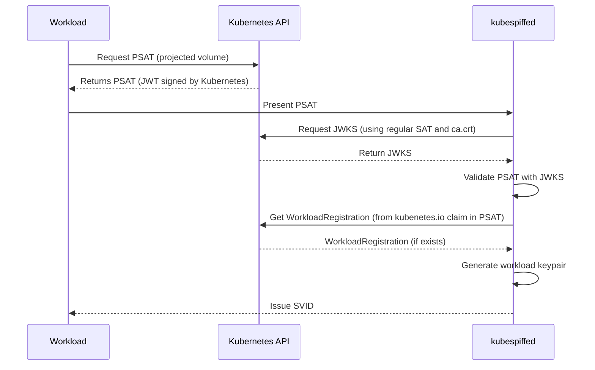

# kubespiffe

An experimental Kubernetes-native implementation of the [SPIFFE standard](https://spiffe.io/). 

⚠️ This exploratory project is an ongoing work-in-progress, and should not be used for workload identity in any environment (least of all production Kubernetes clusters).

## Aims

`kubespiffe` should be able to:

* Issue SVIDs (both X.509 and JWT) to workloads on a Kubernetes cluster
* Manage SVID issuance with Kubernetes resources
* Support federation between two Kubernetes clusters

with the constraints:

* It should only have a single deployed component (i.e. a marked reduction in complexity from implementations like SPIRE, or `cert-manager` + `csi-driver-spiffe`)
* It should not have a completely disqualifying security posture

## Obtaining an SVID



```
2025/11/02 22:30:12 INFO ✅ Pod attested pod=workload-67c559dbb7-r5d5s namespace=default
2025/11/02 22:30:13 INFO ❌ Pod rejected error="failed to get registration for default/unattested-5b77f9d8fc-7r5m7: workloadregistrations.kubespiffe.io \"unattested\" not found"
```

## Development

Run the tests

```
just test
```

Build the Docker image

```
just docker
```

Full KinD stack with `kubespiffed` and workloads can be spun up with:

```
just kind
```

and can be re-deployed with changes with:

```
just deploy
```
